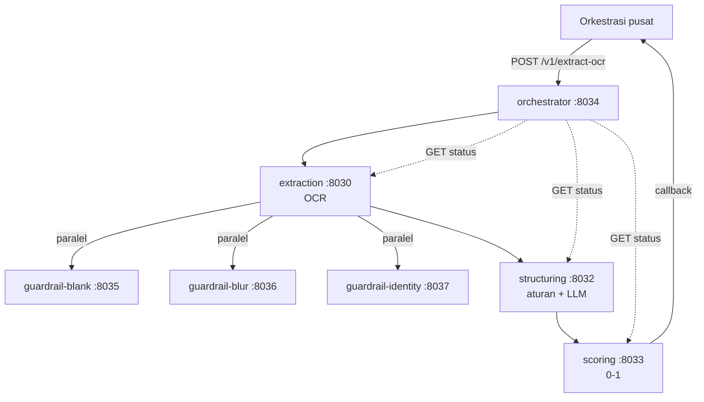

# nilam-ocr-slipgaji

Layanan OCR **slip gaji** untuk NILAM (BRIBrain). Berkas slip gaji masuk, keluar 20 field per slip
beserta `confidence` 0/1. Kontraknya mengikuti **API spec [07] NPWP** (envelope, `pipeline_name_sequence`,
threshold 0–1, kode error, callback), dengan `data` berbentuk slip gaji (satu berkas bisa berisi beberapa slip).

## Service

Tujuh service, satu repo Bitbucket per service ([BITBUCKET_REPOS.md](BITBUCKET_REPOS.md)):

| No | Service | Port | Isi |
|---|---|---|---|
| 1 | `ms-bribrain-nilam-ocr-slipgaji-orchestrator` | 8034 | Pintu masuk, satu-satunya yang dipanggil Orkestrasi pusat |
| 2 | `ms-bribrain-nilam-ocr-slipgaji-extraction` | 8030 | OCR (layanan PaddleOCR), lalu memanggil ketiga guardrail |
| 3 | `ms-bribrain-nilam-ocr-slipgaji-guardrail-blank` | 8035 | Halaman kosong? (aturan panjang teks) |
| 4 | `ms-bribrain-nilam-ocr-slipgaji-guardrail-blur` | 8036 | Terlalu buram? (6 ciri mutu OCR, AUC 0,985) |
| 5 | `ms-bribrain-nilam-ocr-slipgaji-guardrail-identity` | 8037 | Slip gaji atau bukan? (TF-IDF + tata letak, AUC 0,911) |
| 6 | `ms-bribrain-nilam-ocr-slipgaji-structuring` | 8032 | Teks → 20 field per slip (aturan + arbitrase LLM opsional) |
| 7 | `ms-bribrain-nilam-ocr-slipgaji-scoring` | 8033 | P(nilai benar) per field, skala 0–1 |

## 1 · Alur

Rantai serah-terima, bukan hub: tiap tahap menyerahkan hasilnya ke tahap berikutnya; orchestrator hanya
memulai dan menunggu.

```text
        POST /v1/extract-ocr                         GET /v1/extract-ocr/{request_id}
                 │                                                │
          orchestrator :8034   cek berkas (tipe, 2,5 MB, halaman), urutan & threshold
                 │
                 ▼
          extraction :8030          berkas → teks OCR per halaman + ringkasan skor
                 │
                 ├──────────► guardrail-blank    :8035   kosong?     aturan panjang teks
                 ├──────────► guardrail-blur     :8036   terbaca?    6 ciri mutu OCR
                 └──────────► guardrail-identity :8037   slip gaji?  TF-IDF + tata letak
                 │            dipanggil BERSAMAAN, digabung: kosong > buram > identitas
                 │            satu mati / dimatikan → dua lainnya tetap memutuskan
                 ▼
          structuring :8032         teks → 20 field per slip (aturan, + LLM opsional; prompt dari file/DB)
                 │
                 ▼
          scoring :8033             tiap nilai → P(benar) 0–1 → confidence 0/1 per threshold
                 │
                 ▼
     200 / 202 + callback ke Orkestrasi pusat
```



**Guardrail berjalan SETELAH OCR**, bukan sebelumnya seperti NPWP: modelnya membaca teks OCR (AUC 0,911)
dan bukan piksel (0,638). Di kontrak, namanya tetap `guardrails` dan penolakannya dilaporkan
`pipeline_last_stage: guardrails`.

`pipeline_name_sequence` memilih service yang jalan: `guardrails → extraction → structuring → scoring`
(guardrails boleh dilewati, ekor boleh dipotong). Service terakhir menentukan isi `data`.

## Bisa diganti tanpa menyentuh kode

| Apa | Caranya |
|---|---|
| Mematikan satu guardrail | `GUARDRAIL_<BLANK\|BLUR\|IDENTITY>_ENABLED=false` di extraction, atau Helm `--set services.guardrail-blur.enabled=false`. Guardrail yang mati/tidak menjawab dilewati (`GUARDRAILS_FAIL_OPEN=true`) dan tercatat di laporan. |
| Penyedia LLM | `LLM_BACKEND=bedrock\|http\|off`, `LLM_ENDPOINT`, `LLM_MODEL` (structuring). Penyedia lain: `register_chat_backend()` |
| Prompt LLM | Terpisah dari kode: `services/structuring/prompts/slip_gaji.v1.md` (bawaan), `PROMPT_PATH` (volume), atau `PROMPT_SOURCE=db` → tabel `nilam_ocr_slipgaji.system_prompt` (baris `is_active`) |
| Mesin OCR | `EXTRACTION_BACKEND=api\|rapidocr\|mock`, `EXTRACTION_OCR_URL` |
| Ambang | Per permintaan, sisi accept: `guardrails_confidence_threshold` = `{"acc_rej": 0.8}` (atau `identity`/`blur`), `column_confidence_threshold` = `{"all_field": 0.6, "gaji_bersih": 0.9}`. Bawaan: ambang tiap guardrail, `FIELD_CONFIDENCE_THRESHOLD=0.5` |
| Model | JSON di dalam image, atau dari GCS saat start: `<SERVICE>_MODEL_GCS_URI` (bucket `gc-bribrain-dev-gcs-ocr-nilam-01/nilam-ocr-slipgaji/`, folder unggah dari `scripts/export_gcs_models.py`) |
| Basis data | Cloud SQL `nilam` lewat `CLOUDSQL_*` (seperti nilam-ocr-shm; aplikasi Entra → WIF), skema `nilam_ocr_slipgaji`; atau `DATABASE_URL` untuk Postgres lokal |
| Observability | Elastic APM bila `ELASTIC_APM_SERVER_URL` diisi (nama `ms-bribrain-nilam-ocr-slipgaji-<service>`); `/metrics` Prometheus |

## Dokumen lain

- [integration.md](integration.md): kontrak API untuk Orkestrasi pusat (format [07]).
- [api/gateway.openapi.yaml](api/gateway.openapi.yaml): OpenAPI gabungan; tiap service juga punya `/docs`.
- [ARSITEKTUR.md](ARSITEKTUR.md): isi tiap service dan alasan desainnya.
- [deploy/vm/README.md](deploy/vm/README.md): deploy dev, **VM `gc-bribrain-dev-gce-facematch-01` dengan Docker**.
- [deploy/vm/vm.env.example](deploy/vm/vm.env.example): **satu `.env` untuk seluruh alur** (handover), urut dari pintu
  masuk sampai Cloud SQL dan Orkestrasi; rahasia dikosongkan.
- [deploy/DEPLOY.md](deploy/DEPLOY.md): build image, Secret, migrasi, dan Helm untuk GKE (setara nilam-ocr-npwp).
- [db/README.md](db/README.md): skema `nilam_ocr_slipgaji`, migrasi, pindah ke Cloud SQL.

## Menjalankan di lokal

```bash
python -m venv .venv && .venv/bin/pip install -r requirements-dev.txt     # Windows: .venv\Scripts\pip
for s in services/*/; do cp "$s.env.example" "$s.env"; done              # lalu isi API_KEY, EXTRACTION_OCR_URL
python local/run_local.py                 # ketujuh service, tunggu sampai sehat
python scripts/smoke_e2e.py               # kontrak [07] lewat orchestrator (BASE_URL, API_KEY)
python local/run_local.py --stop
```

Docker: `docker compose up -d --build` (tambah `-f docker-compose.db.yml` untuk Postgres lokal).

## Tes dan CI

```bash
make test lint typecheck      # pytest per service, ruff, ty
python scripts/regen_openapi.py
```

CI (`.github/workflows/ci.yml`): lint + tes, migrasi Postgres (termasuk pemindahan ke `nilam_ocr_slipgaji` dan salin ke Cloud SQL), build dan health check ketujuh image, render
Helm chart (termasuk tiap guardrail dimatikan).
